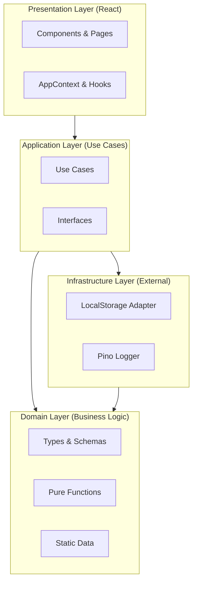

# PTE Class Coverage Tracker

A modern, type-safe React application for tracking PTE exam preparation class coverage and scores.

## Architecture

This project follows a strict **Clean Architecture** with four distinct layers, enforcing unidirectional dependency flow:



### Layers

1.  **Domain**: Pure business logic, Zod schemas, and data structures. Zero external dependencies.
2.  **Application**: Orchestration of user stories (Use Cases). Defines interfaces for infrastructure.
3.  **Infrastructure**: Implementation of external services (Storage, Logging).
4.  **Presentation**: React UI components and state management.

## tech Stack

-   **Framework**: React + Vite
-   **Language**: TypeScript (Strict Mode)
-   **Validation**: Zod
-   **State Management**: React Context + Functional Types (`Result<T>`)
-   **Linting/Formatting**: oxlint + Prettier
-   **Testing**: Vitest + React Testing Library + dependency-cruiser

## Scripts

| Command              | Description                                                                 |
| -------------------- | --------------------------------------------------------------------------- |
| `npm run dev`        | Start development server                                                    |
| `npm run build`      | Build for production                                                        |
| `npm run preview`    | Preview production build                                                    |
| `npm run check`      | Run full verification suite (Format, Lint, Type-Check, Test, Architecture) |
| `npm run lint`       | Run oxlint                                                                  |
| `npm run format`     | Run Prettier                                                                |
| `npm run test`       | Run Unit & Integration Tests                                                |
| `npm run type-check` | Run TypeScript Compiler check                                               |

## Project Structure

```text
src/
├── domain/           # Pure business logic & types
├── application/      # Use cases & orchestration
├── infrastructure/   # External services (Storage, Logger)
├── presentation/     # React components & styles
└── main.tsx          # Entry point
```
