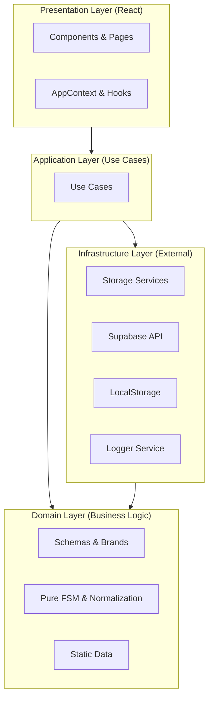

# PTE Class Coverage Tracker

A modern, type-safe React application for tracking PTE exam preparation class coverage and sessions. 

Built using a strict clean architecture and functional programming principles with **Effect-TS** to guarantee correctness, robust error handling, and runtime safety by design.

---

## Key Features

- **☁️ Cloud Sync (Supabase)**: Supports real-time persistence with automatic sync. Includes identity-based loading that aborts initialization on fatal network failures to protect user data.
- **👤 Guest Mode**: Offline-first design utilizing `localStorage` if not logged in.
- **📊 Smart Priority & Weightage**: Orders question types dynamically by mark contribution (High to Low) to focus study plans.
- **🔒 Overwrite on Login**: Overwrites local work with cloud-saved profiles upon sign-in for clean state transitions.

---

## Architectural Principles (Bug-Free by Design)

This codebase enforces strict software safety systems using **Effect-TS**:

- **Type-Safe Functional Effects**: Use of `Effect` tracks both success and failure states in the TypeScript compiler channel, preventing unhandled exceptions.
- **Nominal & Branded Types**: Strongly differentiates distinct database IDs (e.g. `ClassId`, `ModuleId`, `SessionId`) using `@effect/schema` branding to prevent accidental cross-assignment.
- **Strict Boundary Validation**: Evaluates external data at boundaries (network requests, localStorage) using schemas that automatically repair, sanitize, or reject corrupted states.
- **Algebraic Data Errors**: Custom errors inherit from `Data.TaggedError`, facilitating compile-time checks and pattern matching on failure cases.
- **Pure State Machine Transitions**: Managed via a clean, state-driven workflow FSM (`SessionCreationFSM`) that checks transition invariants.
- **State Immutability**: All actions and state transitions inside use cases use pure functional spreads instead of mutating state in-place, eliminating side effects.
- **Property-Based Testing (`fast-check`)**: Core business rules and transition boundaries are validated against thousands of randomized inputs to guarantee correctness.

---

## Architecture Diagram

The project uses clean unidirectional flow logic:


```mermaid
graph TD
    subgraph Presentation["Presentation Layer (React)"]
        UI[Components & Pages]
        Context[AppContext & Hooks]
    end

    subgraph Application["Application Layer (Use Cases)"]
        UC[Use Cases]
    end

    subgraph Domain["Domain Layer (Business Logic)"]
        Models[Schemas & Brands]
        Logic[Pure FSM & Normalization]
        Data[Static Data]
    end

    subgraph Infrastructure["Infrastructure Layer (External)"]
        Storage[Storage Services]
        Supabase[Supabase API]
        Local[LocalStorage]
        Log[Logger Service]
    end

    Presentation --> Application
    Application --> Domain
    Application --> Infrastructure
    Infrastructure --> Domain
```

---

## Tech Stack

- **Framework**: React 19 + Vite
- **Effect Library**: Effect-TS (Core, Schema, Cause)
- **Backend & Auth**: Supabase
- **Styling**: Vanilla CSS (Premium Aesthetics, Dark Mode support)
- **Testing**: Vitest + React Testing Library + fast-check (100% tests passing)

---

## Setup & Configuration

### Environment Variables
Create a `.env` file in the root directory:
```env
VITE_SUPABASE_URL=your_supabase_project_url
VITE_SUPABASE_ANON_KEY=your_supabase_anon_key
```

### GitHub Actions Deployment
For production builds (e.g. GitHub Pages), configure the secrets in your repository settings:
- `VITE_SUPABASE_URL`
- `VITE_SUPABASE_ANON_KEY`

---

## Scripts

Use the following npm scripts for development and verification:

| Command | Description |
| ------- | ----------- |
| `npm run dev` | Starts the Vite development server |
| `npm run build` | Compiles TypeScript and builds the bundle |
| `npm run lint` | Runs `oxlint` with `--deny-warnings` |
| `npm run format` | Formats all code with Prettier |
| `npm run type-check` | Performs strict TypeScript checks |
| `npm run test` | Runs the test suite |
| `npm run test:architecture` | Verifies clean architecture layers with `dependency-cruiser` |
| `npm run check` | Executes formatting, lint, type-checking, tests, and architecture constraints |
