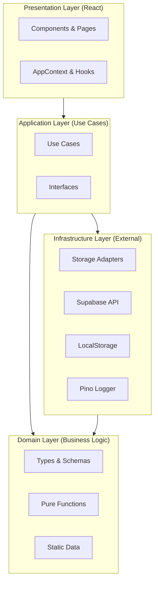

# PTE Class Coverage Tracker

A modern, type-safe React application for tracking PTE exam preparation class coverage and scores.

## Architecture

This project follows a strict **Clean Architecture** with four distinct layers, enforcing unidirectional dependency flow:


```mermaid
graph TD
    subgraph Presentation["Presentation Layer (React)"]
        UI[Components & Pages]
        Context[AppContext & Hooks]
    end

    subgraph Application["Application Layer (Use Cases)"]
        UC[Use Cases]
        Ports[Interfaces]
    end

    subgraph Domain["Domain Layer (Business Logic)"]
        Models[Types & Schemas]
        Logic[Pure Functions]
        Data[Static Data]
    end

    subgraph Infrastructure["Infrastructure Layer (External)"]
        Adapter[Storage Adapters]
        Supabase[Supabase API]
        Local[LocalStorage]
        Log[Pino Logger]
    end

    Presentation --> Application
    Application --> Domain
    Application --> Infrastructure
    Infrastructure --> Domain
```

### Layers

1.  **Domain**: Pure business logic, Zod schemas, and data structures. Zero external dependencies.
2.  **Application**: Orchestration of user stories (Use Cases). Defines interfaces for infrastructure.
3.  **Infrastructure**: Implementation of external services (Storage, Logging). Now includes **Supabase** for cloud sync.
4.  **Presentation**: React UI components and state management.

## Key Features

### ☁️ Cloud Sync (Supabase)
The application now supports **Supabase Persistence**, ensuring your class coverage data is saved across sessions and devices. 
- **Identity-Based Locking**: Prevents synchronization race conditions.
- **Fail-Safe Loading**: Robust error handling that aborts initialization on network failure to protect your cloud data from accidental wipes.

### 👤 Guest Mode
Teachers can choose to **Continue as Guest** to use the application entirely offline via LocalStorage. You can sign in at any time to sync your local work to your cloud profile.

### 📊 Smart Priority & Weightage
Question types are automatically ordered by their contribution to the active skill (High to Low), helping prioritize high-mark tasks.

## Formal Systems Enforcement

This project strictly adheres to formal systems architecture rules to ensure behavioral correctness:

-   **Branded Types**: Distinct domain concepts (e.g., `ClassId`, `ModuleId`) use branded primitives.
-   **Explicit Error Algebra**: Failures are represented as structured domain values (using `Result<T, E>`).
-   **Closed State Machines**: Complex workflows are modeled as FSMs with explicit state transitions.
-   **Boundary Validation**: All external data is strictly validated via Zod schemas at every entry point.

## Tech Stack

-   **Framework**: React 19 + Vite
-   **Backend**: Supabase (Auth & Database)
-   **Language**: TypeScript (Strictest Mode)
-   **Validation**: Zod
-   **Styling**: Vanilla CSS (Premium Aesthetics)
-   **Testing**: Vitest + React Testing Library (24/24 Tests Passing)

## Setup

### Environment Variables
Create a `.env` file in the root directory:
```env
VITE_SUPABASE_URL=your_project_url
VITE_SUPABASE_ANON_KEY=your_anon_key
```

### GitHub Actions Deployment
For the live version on GitHub Pages to work, you must add your Supabase credentials to the repository secrets:
1. Go to your GitHub Repository -> **Settings** -> **Secrets and variables** -> **Actions**.
2. Click **New repository secret**.
3. Add `VITE_SUPABASE_URL` with your Supabase Project URL.
4. Add `VITE_SUPABASE_ANON_KEY` with your Supabase Anon Key.
5. The next time you push to `main`, the deployment will pick up these variables and cloud sync will be enabled.

## Scripts

| Command              | Description                                                                 |
| -------------------- | --------------------------------------------------------------------------- |
| `npm run dev`        | Start development server                                                    |
| `npm run build`      | Build for production                                                        |
| `npm run check`      | Run full verification suite (Format, Lint, Type-Check, Test, Architecture) |
| `npm run test`       | Run Automated Unit & Integration Tests                                      |
| `npm run type-check` | Run TypeScript Compiler check                                               |

## Project Structure

```text
src/
├── domain/           # Pure business logic & types
├── application/      # Use cases & orchestration
├── infrastructure/   # External services (Supabase, LocalStorage, Logs)
├── presentation/     # React components & styles
└── main.tsx          # Entry point
```
